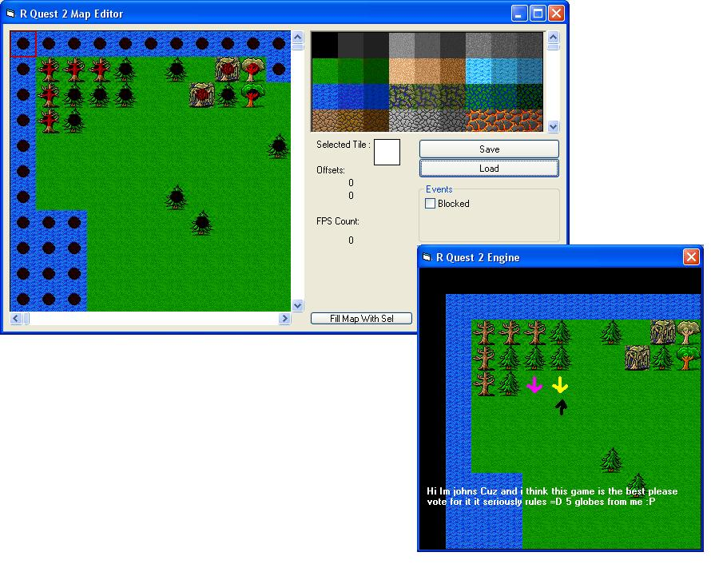



## R Quest \( RPG \) 2

### Description

Hey every one again well after 2 days of releseing R Quest 1 i relese R Quest 2 :D what does it do thats so good well now its more of a rpg maker that a map editor And now its Highly Commented

Mapper Features:

Endless tile support

No LAG!! At all runs perfectly fine on 1 ghz!

COLLISIONS!!!!

Fps

Map Scroling

Saveing and Loading

Game Runner:

Npc's!! really cool :D

npc movement they can follow u / move random

Scroling

Player Animation

Loading / Saveing of INI's

Players

Npc > Monsters (very basic tho they chase you thats about it lol)

Now this is how to use it when you have made a map useing my basic map editor copy the maps folder into the game directory overwrite the old 1 :) fairly basic so far then run the game.

Movement uses the arrow keys

Action = Space e.g your under a npc to talk to him press space

And there is a small Technical demo of the chaseing system

press the letter T whilst standing neer the 2 npc's by the tree one of them will chase you if you walk out of his boundtry which is 3 tiles arround him he will move randomly (this can be used for wiled monsters that attack you ect).

PLEASE VOTE AND POST YOUR RESONSES!!!!! I REALLY NEED FEEDBACK ON THIS OR ELSE R QUEST 3 WONT BE RELESED!!!
 
### More Info
 

             |
---                |---
**Submitted On**   |2005-02-19 08:25:26
**By**             |[Ryan L \(rm200ie\)](https://github.com/Planet-Source-Code/PSCIndex/blob/master/ByAuthor/ryan-l-rm200ie.md)
**Level**          |Intermediate
**User Rating**    |4.9 (34 globes from 7 users)
**Compatibility**  |VB 6\.0
**Category**       |[Games](https://github.com/Planet-Source-Code/PSCIndex/blob/master/ByCategory/games__1-38.md)
**World**          |[Visual Basic](https://github.com/Planet-Source-Code/PSCIndex/blob/master/ByWorld/visual-basic.md)
**Archive File**   |[R\_Quest\_\(\_1854802192005\.zip](https://github.com/Planet-Source-Code/ryan-l-rm200ie-r-quest-rpg-2__1-59004/archive/master.zip)

